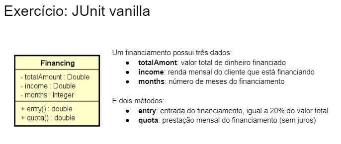

# JUnit Vanilla 🧪

    

---

Há ainda uma regra: o valor da prestação não pode ser maior que metade da renda mensal do cliente. A seguir alguns exemplos de financiamentos para ajudar a entender a regra:

 

<ul>
<b>Exemplo 1:</b> { totalAmount: 100000, income: 2000, months: 20 }  

    Este exemplo é INVÁLIDO porque com esses dados a entrada seria 20000 e a prestação seria 4000. Porém a prestação não pode passar de 1000, que é a metade da renda do cliente.

 
 

<b>Exemplo 2</b> { totalAmount: 100000, income: 2000, months: 80 }  

    Já este exemplo é VÁLIDO porque a entrada seria 20000 e a prestação seria 1000. Neste caso, a prestação é menor ou igual a metade da renda do cliente, satisfazendo a regra. 
</ul>

 

Você deve implementar os seguintes testes para validar esta classe (total = 10 testes):

 

<ul>

## Construtor 
- [x] Deve criar o objeto com os dados corretos quando os dados forem válidos
- [x] Deve lançar IllegalArgumentException quando os dados não forem válidos.

 

## setTotalAmount
- [x] Deve atualizar o valor quando os dados forem válidos
- [x] Deve lançar IllegalArgumentException quando os dados não forem válidos

 

## setIncome
- [ ] Deve atualizar o valor quando os dados forem válidos
- [ ] Deve lançar IllegalArgumentException quando os dados não forem válidos

 

## setMonths
- [ ] Deve atualizar o valor quando os dados forem válidos
- [ ] Deve lançar IllegalArgumentException quando os dados não forem válidos

 

## entry
- [ ] Deve calcular corretamente o valor da entrada

 

## quota
- [ ] Deve calcular corretamente o valor da prestação
</ul>
